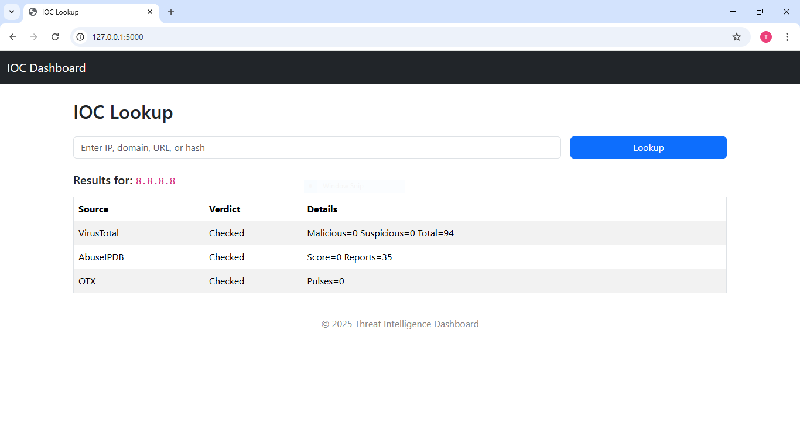

# Threat Intelligence Dashboard

A simple Flask-based dashboard to check Indicators of Compromise (IOCs) against multiple Threat Intelligence APIs.

## Features
- Lookup IP, Domain, URL, and File Hashes.
- Integrates with:
  - AbuseIPDB
  - VirusTotal
  - AlienVault OTX
- Async requests using `httpx` for speed.
- Clean Bootstrap 5 UI.


## Installation
 Clone the repo:
   ```bash
   git clone https://github.com/temidayotitilola/threat-intel-dashboard.git
   cd threat-intel-dashboard
   Create a virtual environment & install dependencies:

python -m venv .venv
.venv\Scripts\activate  # On Windows
source .venv/bin/activate  # On Linux/Mac

pip install -r requirements.txt


Add API keys in a .env file:

ABUSEIPDB_API_KEY=your_key_here
VIRUSTOTAL_API_KEY=your_key_here
OTX_API_KEY=your_key_here


Run the app:

flask run


Open in browser:

http://127.0.0.1:5000


